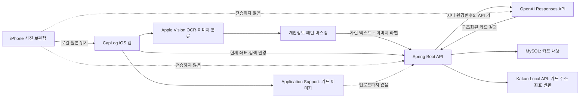

# CapLog

> 스크린샷을 저장하는 데서 끝내지 않고, 다시 활용할 수 있는 정보 카드로 바꾸는 iOS 앱

CapLog는 iPhone 사진 보관함의 스크린샷을 분석해 제목, 요약, 카테고리, 태그, 장소, 날짜 등의 구조화된 카드로 정리합니다. 사용자는 흩어진 스크린샷을 폴더와 검색으로 다시 찾고, 현재 위치나 마감일에 맞는 추천과 알림을 확인하며, 필요한 카드 내용을 친구와 공유할 수 있습니다.

이 프로젝트는 **2025년 6월 팀 졸업프로젝트로 완성되어 장려상을 수상**한 뒤, **배서연이 개인 프로젝트로 계속 개발하고 있는 서비스**입니다. 졸업프로젝트 이후 기존 구조를 단순히 유지한 것이 아니라, UI/UX 대부분을 다시 설계하고 개인정보 보호와 인증 보안을 강화했으며 주요 Mock 기능을 실제 서버 데이터 흐름으로 전환했습니다.

---

## 프로젝트 한눈에 보기

| 항목 | 내용 |
|---|---|
| 프로젝트명 | CapLog |
| 서비스 형태 | iOS 기반 개인화 스크린샷 정보 관리 앱 |
| 시작 | 팀 졸업프로젝트 |
| 졸업프로젝트 완료 | 2025.06 |
| 졸업프로젝트 성과 | 장려상 |
| 개인 고도화 | 2025.06 이후 ~ 현재 |
| 현재 개발·관리 | 배서연 |
| 핵심 가치 | 자동 정리, 맥락 기반 재활용, 개인정보 보호 |

---

## 왜 CapLog인가

스크린샷은 필요한 순간 빠르게 정보를 저장할 수 있지만, 시간이 지나면 갤러리 안에서 다시 찾기 어렵습니다. 특히 쿠폰 만료일, 채용 공고 마감일, 맛집 위치, 공부 자료처럼 **내용과 맥락이 중요한 정보**도 이미지 한 장으로만 남습니다.

CapLog는 이 문제를 다음 흐름으로 해결합니다.

1. iPhone에 저장된 스크린샷을 찾습니다.
2. 기기 안에서 OCR과 이미지 분류를 수행합니다.
3. 개인정보 패턴을 가린 텍스트를 AI로 구조화합니다.
4. 결과를 검색 가능한 카드로 저장합니다.
5. 위치, 마감일, 최근 사용 기록에 맞춰 다시 보여줍니다.

즉, CapLog의 목표는 스크린샷을 단순한 이미지가 아니라 **다시 사용할 수 있는 생활 정보 자산**으로 바꾸는 것입니다.

---

## 현재 주요 기능

### 스크린샷 자동 인식과 카드 생성

- 로그인 후 사진 보관함의 스크린샷을 자동으로 탐색
- 새로 저장된 스크린샷 감지
- Apple Vision 기반 온디바이스 OCR
- Apple Vision 기반 온디바이스 이미지 분류
- OCR 텍스트와 이미지 라벨을 이용한 AI 카드 구조화
- 제목, 요약, 대·소분류, 태그, 장소, 날짜 등 자동 생성
- AI 응답 실패 시 OCR 기반 대체 카드 생성
- 처리 진행률, 성공·실패 상태와 재시도 UI 제공

### 카드 탐색과 관리

- 홈의 마감 임박, 추천, 최근 본 카드
- 대분류·소분류 기반 폴더 탐색
- 제목, 요약, 태그, 장소 기반 검색
- 카드 상세 조회, 수정, 삭제
- 최근 본 카드 기록
- 의미별 SF Symbols와 카테고리 포인트 색상
- 카드 이미지의 기기 내부 저장과 복원

### 위치 기반 추천과 앱 내부 알림

- 현재 위치 주변의 장소 카드 추천
- 카드 주소를 좌표로 변환해 거리순 조회
- 쿠폰, 공고, 취업 카드의 마감 임박 알림
- 현재 위치 주변에 저장된 장소가 있을 때 근처 카드 알림
- 새 메시지와 카드 공유에 대한 앱 내부 알림
- 알림 읽음 처리와 삭제

현재 알림은 APNs 푸시가 아니라 **앱을 열었을 때 갱신되는 내부 알림**입니다.

### 친구, 채팅과 카드 공유

- 실제 계정 ID 기반 친구 추가·목록·삭제
- 1:1 채팅방 재사용
- 그룹 채팅방 생성
- 텍스트 메시지 저장과 읽음 상태
- 주기적 폴링을 통한 새 메시지 갱신
- 구조화된 카드 스냅샷 공유
- 채팅방 나가기

카드를 공유할 때는 원본 스크린샷을 보내지 않고 제목, 요약, 태그, 필드 등 사용자가 확인할 수 있는 **구조화된 카드 내용만 공유**합니다.

### 계정과 세션

- 이메일 회원가입과 로그인
- 프로필 조회·수정
- 현재 비밀번호 확인 후 비밀번호 변경
- 로그아웃
- JWT access/refresh token 발급과 서버 측 refresh token 회전
- iOS Keychain 기반 토큰 저장
- 세션 만료 시 토큰 정리와 재로그인 안내

---

## 현재 개인정보 보호 구조

스크린샷에는 대화, 계정 정보, 결제 정보 등 민감한 내용이 포함될 수 있습니다. 졸업프로젝트 이후 가장 크게 바꾼 부분 중 하나는 **원본 이미지를 외부로 보내지 않는 구조**입니다.

| 데이터 | iPhone | CapLog 서버 | 외부 AI |
|---|---:|---:|---:|
| 원본 스크린샷 | 저장·처리 | 전송하지 않음 | 전송하지 않음 |
| 앱 내부 카드 이미지 | 로컬 저장 | 전송하지 않음 | 전송하지 않음 |
| 가리기 전 OCR 전문 | 처리 중에만 사용 | 전송하지 않음 | 전송하지 않음 |
| 개인정보를 가린 OCR 텍스트 | 처리 | AI 중계 시 전달 | 전달 |
| Apple Vision 이미지 라벨 | 처리 | AI 중계 시 전달 | 전달 |
| 카드 제목·요약·태그·필드 | 저장 | DB 저장 | 구조화 결과 반환 |

현재 적용된 원칙은 다음과 같습니다.

- Google Vision 원본 이미지 전송 제거
- 서버 이미지 업로드 기능 제거
- Apple Vision OCR·이미지 분류를 iPhone 안에서 실행
- 이메일, 전화번호, 주민등록번호, 카드번호 패턴 마스킹
- GPT에는 원본 이미지가 아닌 가린 텍스트와 분류 라벨만 전달
- 카드 이미지는 `Application Support/CardImages`에 파일 보호를 적용해 저장
- 카드 이미지 디렉터리를 iCloud 및 기기 백업 대상에서 제외
- 서버에는 카드의 구조화된 내용만 저장

---

## 현재 데이터 흐름



---

## 프로젝트 연혁과 기여

### 1. 팀 졸업프로젝트

CapLog는 24팀 **강배우**의 졸업프로젝트로 시작했습니다. 팀원들과 함께 기획, AI 분석, 백엔드, iOS 앱을 개발했고 **2025년 6월 졸업프로젝트를 마무리하며 장려상을 수상**했습니다.

| 구분 | 내용 |
|---|---|
| 팀명 | 강배우 |
| 지도교수 | 민동보 교수님 |
| 강다혜 | 팀장, AI·백엔드 |
| 배서연 | 백엔드 총괄, 기획, 프로토타입 제작, 백엔드–프론트엔드 연동 |
| 우민하 | iOS 프론트엔드 |

팀 프로젝트 단계에서 **배서연**은 다음 역할을 담당했습니다.

- Spring Boot 백엔드 전반 설계와 구현 총괄
- iOS 프론트엔드와 백엔드 API 연결
- 서비스 기획과 기능 흐름 정의
- 초기 프로토타입 제작
- AI 분석 결과를 카드 데이터로 저장하는 서버 흐름 구현
- 팀 내 프론트엔드·AI·백엔드 기능 통합

### 2. 졸업프로젝트 이후 개인 고도화

졸업프로젝트가 끝난 뒤에도 배서연이 개인적으로 개발을 이어갔습니다. 현재 저장소의 UI, 보안 정책, 개인정보 처리 구조와 주요 실데이터 기능은 이 개인 고도화 과정에서 크게 변경됐습니다.

#### UI/UX 전면 개선

- 홈, 검색, 폴더, 공유, 마이페이지의 화면 구조 재설계
- 앱 전체 딥그린 브랜드 색상과 저채도 포인트 팔레트 정리
- iPhone 이모티콘을 의미별 SF Symbols로 교체
- 폴더 대·소분류 아이콘과 선택 상태 개선
- 카드가 없을 때 이유와 다음 행동을 안내하는 빈 상태 추가
- 카드 생성 진행률, 성공, 실패, 재시도 흐름 추가
- 한국어 문구와 상태 안내 개선
- 카드 제목이 시간 문자열로 잘못 생성되는 문제 완화

#### 개인정보 중심 이미지 처리 구조로 전환

- Google Vision 기반 원본 이미지 전송 제거
- 서버의 스크린샷 업로드·조회 경로 제거
- Apple Vision 온디바이스 OCR·분류 도입
- OCR 개인정보 마스킹 도입
- 카드 이미지 로컬 전용 저장소 구현
- iCloud에만 존재하는 사진을 자동 다운로드하지 않도록 제한
- 공유 시 이미지 대신 구조화된 카드 스냅샷만 전송

#### 인증과 서버 보안 강화

- JWT secret의 길이와 필수 환경변수 검증
- BCrypt 비밀번호 해시와 비밀번호 정책 강화
- access/refresh token 로그 제거
- iOS 토큰 저장소를 UserDefaults에서 Keychain으로 이전
- OpenAI API 키를 iOS에서 제거하고 백엔드 환경변수로 이동
- Kakao 키와 서버 주소를 Git 제외 로컬 설정으로 분리
- Release 빌드의 HTTPS 서버 주소 검증
- 전역 비보안 네트워크 허용 설정 제거
- 로그인, 회원가입, AI 요청 등 주요 API rate limit 적용
- JWT 사용자 기준 데이터 소유권과 사용자별 조회 격리 강화

#### Mock 기능의 실제 서버 연동

- 실제 계정 기반 친구 추가·삭제
- 실제 채팅방 생성과 기존 1:1 채팅방 재사용
- 텍스트·카드 메시지 DB 영구 저장
- 카드 수정·삭제의 서버 반영
- 실제 위치 기반 추천 API 연결
- 카드 마감·근처 장소·채팅 기반 앱 내부 알림
- 비밀번호 변경과 세션 만료 처리

#### 안정성과 개발 환경 개선

- Swift Concurrency와 MainActor 경고 정리
- 스크린샷 자동 감지 중복·동시성 처리 보완
- AI 실패 시 대체 카드와 로컬 복구 흐름 추가
- 만료일 파싱과 당일 카드 표시 오류 개선
- Gradle Wrapper 복구와 배포 ZIP 체크섬 고정
- 앱 전체 동작, 보안 정책, 제약 사항 문서화

---

## 기술 스택

### iOS

| 영역 | 기술 |
|---|---|
| 언어·UI | Swift, SwiftUI |
| 사진 접근 | Photos, PhotoKit |
| OCR | Apple Vision `VNRecognizeTextRequest` |
| 이미지 분류 | Apple Vision `VNClassifyImageRequest` |
| 위치 | CoreLocation, CLGeocoder |
| 보안 저장소 | iOS Keychain |
| 로컬 데이터 | UserDefaults, Application Support |
| 네트워크 | URLSession, Codable |
| 소셜 SDK 흔적 | Google Sign-In, Kakao SDK |

### Backend

| 영역 | 기술 |
|---|---|
| 언어 | Java 17 |
| 프레임워크 | Spring Boot 3.3.2 |
| API | Spring MVC, WebFlux |
| 인증·인가 | Spring Security, JWT |
| 비밀번호 | BCrypt |
| ORM | Spring Data JPA, Hibernate |
| 데이터베이스 | MySQL |
| 빌드 | Gradle Wrapper 8.10 |

### AI·외부 서비스

| 영역 | 기술 |
|---|---|
| 카드 구조화 | OpenAI Responses API |
| 기본 모델 | `gpt-4o-mini` |
| 주소 좌표 변환 | Kakao Local API |
| 이미지 분석 | Apple Vision 온디바이스 처리 |

---

## 저장소 구조

```text
.
├── App/                       # iOS 앱 진입점
├── Core/
│   ├── Auth/                  # 인증 상태와 Keychain 토큰
│   ├── Card/                  # 카드 모델·뷰·관리
│   ├── Data/                  # OCR, 이미지 저장, 스크린샷 처리
│   ├── Network/               # iOS API 클라이언트
│   └── Permissions/           # 사진·위치 권한
├── Features/
│   ├── Home/
│   ├── Folder/
│   ├── Search/
│   ├── Share/
│   ├── MyPage/
│   ├── OCR/
│   └── Register/
├── Theme/                     # 앱 색상과 에셋
├── UIComponents/              # 공통 SwiftUI 컴포넌트
├── src/main/java/             # Spring Boot 백엔드
├── src/main/resources/        # 서버 설정
├── src/test/                  # 백엔드 테스트
└── docs/                      # 설계·보안·졸업프로젝트 문서
```

---

## 로컬 실행

### 요구 환경

- macOS와 Xcode
- iOS 17.6 이상 시뮬레이터 또는 실제 iPhone
- Java 17
- MySQL
- OpenAI API 키
- 위치 좌표 변환을 사용할 경우 Kakao REST API 키

### 1. MySQL 준비

기본 개발 설정은 다음 주소를 사용합니다.

```text
jdbc:mysql://localhost:3307/caplog
```

필요하면 `SPRING_DATASOURCE_URL`로 변경할 수 있습니다.

### 2. 백엔드 환경변수

실제 비밀값은 소스 코드나 Git에 커밋하지 않습니다.

```bash
export JWT_SECRET="32바이트 이상의 무작위 값"
export SPRING_DATASOURCE_PASSWORD="MySQL 비밀번호"
export OPENAI_API_KEY="OpenAI API 키"
export KAKAO_REST_API_KEY="Kakao REST API 키"

# 선택 설정
export SPRING_DATASOURCE_URL="jdbc:mysql://localhost:3307/caplog"
export SPRING_DATASOURCE_USERNAME="caplog"
export OPENAI_MODEL="gpt-4o-mini"
export APP_BASE_URL="http://localhost:8080"
```

### 3. 백엔드 실행

```bash
./gradlew bootRun
```

기본 포트는 `8080`입니다.

### 4. iOS 로컬 설정

```bash
cp Secrets.local.xcconfig.example Secrets.local.xcconfig
```

`Secrets.local.xcconfig`에 로컬 Kakao 네이티브 앱 키를 설정합니다. 이 파일은 Git에 포함하지 않습니다.

Release 빌드는 `CAPLOG_API_BASE_URL`에 HTTPS 운영 서버 주소가 필요합니다. Debug 빌드에서 실제 iPhone을 사용한다면 Mac과 iPhone이 같은 네트워크에 있어야 하며, 개발 서버 주소가 Mac의 LAN 주소와 일치해야 합니다.

### 5. iOS 실행

1. `Caplog.xcodeproj`를 Xcode에서 엽니다.
2. 시뮬레이터 또는 실제 iPhone을 선택합니다.
3. `Cmd + R`로 실행합니다.

실제 사진 보관함과 Apple Vision 흐름은 실제 iPhone에서 확인하는 것이 가장 정확합니다.

---

## 현재 제약과 다음 과제

현재 저장소는 계속 개발 중인 개인 프로젝트이며 아직 App Store 배포 상태는 아닙니다.

- iCloud에만 있고 iPhone에 내려받지 않은 사진은 처리하지 않음
- 카드 이미지는 현재 기기에만 있어 앱 삭제·기기 변경 시 복구할 수 없음
- 앱 내부 알림만 제공하며 APNs 푸시는 아직 없음
- 채팅은 WebSocket이 아닌 약 3초 주기의 폴링 방식
- 자동 access token 갱신과 원 요청 재시도 미완성
- Apple·Google·Kakao 소셜 로그인은 클라이언트 코드가 일부 남아 있지만 서버 계정 통합은 미완성
- 실제 회원 탈퇴와 전체 데이터 삭제 흐름 미완성
- 공유 전 민감 필드를 선택적으로 제외하는 기능 필요
- DB migration, 운영 HTTPS, secret manager, 모니터링 구성 필요

---

## 관련 문서

- [통합 설계·동작·제약 사항](docs/project-architecture-and-constraints.md)
- [보안 강화 변경사항](docs/security-hardening.md)
- [스크린샷 카드 생성 설정과 문제 해결](docs/screenshot-setup.md)
- [MySQL 설정](docs/mysql-setup.md)
- [졸업프로젝트 1차 보고서](docs/report1.md)
- [졸업프로젝트 2차 보고서](docs/report2.md)
- [졸업프로젝트 최종 보고서](docs/report3.md)

---

## 프로젝트 방향

CapLog는 팀 졸업프로젝트에서 출발했지만, 현재는 배서연이 직접 제품 구조와 사용자 경험을 다시 설계하며 발전시키고 있는 개인 프로젝트입니다.

앞으로도 다음 원칙을 유지합니다.

1. 원본 스크린샷보다 사용자의 개인정보 보호를 우선합니다.
2. 기능을 화면에만 구현하지 않고 실제 데이터 흐름까지 연결합니다.
3. 실패 이유와 데이터 저장 위치를 사용자가 이해할 수 있게 만듭니다.
4. 팀 프로젝트의 출발점과 기여를 존중하면서 개인 고도화 이력을 투명하게 기록합니다.
