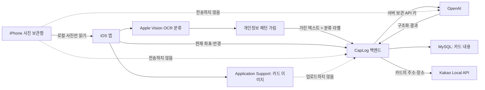

# CapLog 통합 설계·동작·제약 사항 문서

> 최종 확인 기준: 2026-07-29, `main` 브랜치
>
> 이 문서는 CapLog의 현재 구현, 지금까지 적용한 주요 변경, 개인정보 처리 원칙, 데이터 저장 위치, 기능별 동작 흐름, 의도적으로 둔 제약, 미완성 기능과 배포 전 점검 사항을 한곳에서 확인하기 위한 기준 문서다.
>
> 코드와 이 문서가 다를 경우 코드가 실제 동작의 기준이다. 기능을 변경할 때는 이 문서도 함께 갱신한다.

---

## 1. 문서에서 사용하는 상태

| 상태 | 의미 |
|---|---|
| **구현됨** | 현재 앱과 서버 코드에 실제로 연결되어 동작한다. |
| **의도적 제약** | 개인정보 보호나 제품 방향 때문에 일부 기능을 일부러 제한했다. |
| **부분 구현** | 기본 흐름은 동작하지만 예외 처리, 동기화, 운영 기능 등이 부족하다. |
| **미구현** | 화면, API 상수 또는 Mock만 있고 실제 서버 기능은 없다. |
| **배포 전 필수** | 개발 중에는 넘어갈 수 있지만 실제 사용자에게 배포하기 전 반드시 처리해야 한다. |

---

## 2. 앱의 목적과 핵심 원칙

CapLog는 사용자의 사진 보관함에서 스크린샷을 찾고, 스크린샷 속 텍스트와 이미지 특징을 분석해 검색 가능한 카드로 정리하는 iOS 앱이다. 카드에는 제목, 요약, 카테고리, 태그, 장소, 날짜 등의 구조화된 정보가 들어간다.

현재 제품의 가장 중요한 원칙은 다음과 같다.

1. **원본 스크린샷은 사용자의 iPhone 밖으로 전송하지 않는다.**
2. **OCR과 이미지 분류는 Apple Vision을 사용해 기기 안에서 수행한다.**
3. **Google Vision은 사용하지 않는다.**
4. **GPT에는 원본 이미지가 아니라 개인정보 패턴을 가린 OCR 텍스트와 Apple Vision 분류 라벨만 보낸다.**
5. **서버에는 카드의 구조화된 내용만 저장한다.**
6. **카드 이미지 사본은 앱 내부 로컬 저장소에만 보관하며 iCloud 백업 대상에서도 제외한다.**
7. **공유할 때도 원본 이미지는 전달하지 않고 카드의 구조화된 스냅샷만 전달한다.**
8. **현재 앱 알림은 푸시 알림이 아니라 앱을 열었을 때 생성되는 내부 알림이다.**

이 원칙은 편의성보다 스크린샷에 포함될 수 있는 개인정보 보호를 우선한 결정이다. 따라서 재설치, 기기 변경, 사진 삭제 상황에서 이미지를 복구하지 못하는 한계가 생긴다.

---

## 3. 전체 시스템 구성

### 3.1 기술 구성

| 영역 | 현재 기술 |
|---|---|
| iOS 앱 | Swift, SwiftUI |
| 사진 접근 | Photos / PhotoKit |
| OCR | Apple Vision `VNRecognizeTextRequest` |
| 이미지 분류 | Apple Vision `VNClassifyImageRequest` |
| 위치 | CoreLocation, CLGeocoder |
| 인증 정보 저장 | iOS Keychain |
| 로컬 카드/상태 저장 | UserDefaults + Application Support |
| 백엔드 | Java 17, Spring Boot 3.3.2 |
| 인증 | Spring Security, JWT, BCrypt |
| DB | MySQL 8.4, Spring Data JPA |
| AI 구조화 | OpenAI Responses API, 기본 모델 `gpt-4o-mini` |
| 주소 좌표 변환 | Kakao Local API |
| 빌드 | Xcode, Gradle Wrapper 8.10 |

### 3.2 주요 데이터 흐름



### 3.3 서버에 가는 정보와 가지 않는 정보

| 데이터 | iPhone 로컬 | CapLog 서버 | 외부 서비스 |
|---|---:|---:|---:|
| 원본 스크린샷 | O | X | X |
| 앱이 복사한 카드 이미지 | O | X | X |
| 가리기 전 OCR 전문 | 처리 중 메모리에만 존재 | X | X |
| 개인정보 패턴을 가린 OCR 텍스트 | 처리 중 존재 | AI 중계 시 전달 | OpenAI에 전달 |
| Apple Vision 이미지 라벨 | 처리 중 존재 | AI 중계 시 전달 | OpenAI에 전달 |
| 카드 제목·요약·태그·필드 | O | O | OpenAI가 생성 결과 반환 |
| 카드 장소·주소·좌표 | O | O | 주소·장소는 Kakao에 전달 가능 |
| 사용자의 현재 좌표 | 위치 추천 요청 중 | O, 요청 처리용 | Kakao에는 현재 좌표를 보내지 않음 |
| 채팅 메시지 | 화면 표시 | O | X |
| 공유 카드 | 구조화된 스냅샷 | O | X |

---

## 4. 사용자가 경험하는 전체 앱 흐름

### 4.1 가입과 로그인

1. 사용자가 이메일, 비밀번호, 닉네임으로 가입한다.
2. 서버는 비밀번호를 BCrypt로 해시해 저장한다.
3. 로그인에 성공하면 access token과 refresh token을 반환한다.
4. 앱은 두 토큰을 UserDefaults가 아닌 Keychain에 저장한다.
5. 이후 보호 API 호출에는 access token을 Bearer 토큰으로 보낸다.
6. access token이 만료되어 401을 받으면 현재 앱은 자동 갱신하지 않고 토큰을 지운 뒤 재로그인을 안내한다.

자세한 제약은 [11. 계정과 인증](#11-계정과-인증)에 정리되어 있다.

### 4.2 스크린샷에서 카드 생성

1. 회원가입 또는 로그인 뒤 권한 안내에서 사용자가 사진 접근 권한을 허용한다.
2. 로그인이 완료되어 메인 화면에 진입한 동안에만 새 스크린샷 감시를 시작한다.
3. 앱이 사진 보관함의 스크린샷 스마트 앨범을 읽는다.
4. iPhone에 원본이 실제로 내려받아져 있는 사진만 가져온다.
5. Apple Vision으로 OCR과 이미지 분류를 기기 안에서 수행한다.
6. OCR 결과에서 이메일, 전화번호, 주민등록번호, 카드번호 패턴을 가린다.
7. 가린 텍스트와 이미지 라벨을 CapLog 백엔드로 보낸다.
8. 백엔드는 서버 환경변수에 있는 OpenAI API 키로 OpenAI에 요청한다.
9. GPT가 카드 제목, 요약, 카테고리, 태그, 날짜, 장소 등의 구조를 반환한다.
10. GPT 호출 또는 결과 파싱에 실패해도 OCR 기반 대체 카드를 만든다.
11. 구조화된 카드 내용은 서버 DB에 저장한다.
12. 카드 이미지 사본은 iPhone 앱 내부 저장소에만 저장한다.
13. 생성 결과와 실패 건수는 마이페이지의 카드 생성 상태에서 확인한다.

### 4.3 카드 탐색과 관리

- 홈에서 최근 카드와 추천 카드를 본다.
- 검색 탭에서 현재 기기에 로드된 카드의 제목, 요약, 하위 카테고리, 태그, 장소를 검색한다.
- 카드를 열면 최근 본 카드 목록에 기록된다.
- 카드 수정과 삭제는 서버 카드일 경우 서버에도 반영한다.
- 서버 저장에 실패해 로컬 전용으로 남은 카드는 해당 기기에서만 수정·삭제할 수 있다.

### 4.4 위치 기반 추천과 앱 내부 알림

- 앱이 현재 위치를 한 번 조회한다.
- 서버에 현재 위도·경도, 검색 반경과 개수를 전달한다.
- 서버는 로그인한 사용자의 카드 중 좌표가 있는 카드를 거리순으로 찾는다.
- 홈에서는 가까운 장소 카드를 추천한다.
- 알림 화면에는 가까운 장소 카드와 마감일이 임박한 카드를 내부 알림으로 만든다.
- 백그라운드 지오펜싱이나 푸시 알림은 현재 없다.

### 4.5 친구, 채팅과 카드 공유

- 친구의 정확한 사용자 ID를 입력해 친구를 추가한다.
- 친구와 1:1 또는 그룹 채팅방을 만든다.
- 메시지는 서버 DB에 저장한다.
- 채팅 화면이 열려 있는 동안 약 3초마다 새 메시지를 조회한다.
- 카드를 보내면 원본 이미지가 아니라 전송 시점의 구조화된 카드 사본이 메시지에 저장된다.
- 카드가 나중에 수정되거나 삭제되어도 이미 보낸 카드 스냅샷은 바뀌지 않는다.

---

## 5. 스크린샷 인식 범위와 제한

### 5.1 자동·수동 가져오기

**구현됨**

- 로그인 전 시작 화면에서는 사진 권한을 요청하거나 스크린샷을 감시하지 않는다.
- 회원가입·로그인 권한 안내를 마치고 메인 화면에 들어간 뒤에만 감시한다.
- 앱이 실행 중일 때 새 스크린샷을 감지한다.
- 초기 인덱싱에서는 최근 스크린샷을 최대 20장 처리한다.
- 사용자가 직접 가져올 때도 한 번에 최대 20장을 처리한다.
- 처리 기록을 초기화한 뒤 다시 가져오는 흐름에서는 최대 50장까지 본다.
- 사진 접근이 제한된 경우 사용자가 허용한 사진만 처리한다.
- 시뮬레이터 등 스크린샷 스마트 앨범을 정상적으로 얻지 못하는 환경에서는 최근 항목을 보조 경로로 사용할 수 있다.

**의도적 제약**

- PhotoKit 요청의 네트워크 접근을 끈 상태다.
- iCloud에만 있고 현재 iPhone에 원본이 내려받아지지 않은 사진은 자동 다운로드하지 않는다.
- 즉, 사진 앱에 썸네일이 보이더라도 원본이 로컬에 없으면 카드 생성에 실패할 수 있다.
- 이 제약은 iCloud 사진을 사용하지 않고 “현재 폰에 있는 사진만 처리”한다는 제품 결정이다.

### 5.2 중복 처리 방지

- PhotoKit의 asset identifier 또는 내부 이미지 키를 이용해 같은 기기에서 같은 스크린샷을 반복 처리하지 않도록 한다.
- 처리 완료 식별자는 UserDefaults에 최대 500개까지 저장한다.
- 처리 완료 식별자와 최초 가져오기 여부는 JWT subject를 해시한 계정별 키로 분리한다.
- 업데이트 전 공용 처리 기록은 업데이트 후 최초 로그인한 계정으로 한 번만 이전한다.
- 서버 저장에 성공한 뒤에 처리 완료로 기록한다.
- 서버 저장에 실패한 경우 재시도할 수 있도록 완료 처리하지 않는다.

**알려진 한계**

- 중복 식별자는 기기 로컬에만 있다.
- 앱을 삭제하거나 처리 기록을 초기화하면 같은 사진이 다시 카드로 만들어질 수 있다.
- PhotoKit asset identifier는 서버에 저장하지 않는다.
- 다른 기기나 재설치 후에는 서버가 같은 원본인지 판단할 수 없으므로 DB에 중복 카드가 생길 수 있다.

### 5.3 처리 상태 UI

- 대기, 처리 중, 전체 건수, 성공 수, 실패 수, 서버 동기화 경고를 표시한다.
- 실패한 항목이 있으면 재시도할 수 있다.
- 홈의 빈 상태에서도 바로 스크린샷 가져오기로 이동할 수 있다.

**알려진 한계**

- 처리 상태는 메모리 기반이며 앱을 완전히 종료하면 사라진다.
- 실패 작업을 영구 큐로 저장하는 백그라운드 작업 시스템은 아직 없다.
- 앱이 백그라운드로 내려간 상태에서 장시간 작업을 보장하지 않는다.

---

## 6. OCR, 이미지 분류와 GPT 구조화

### 6.1 Apple Vision OCR

**구현됨**

- 원본 이미지는 `VNRecognizeTextRequest`로 기기 안에서 읽는다.
- OCR을 위해 이미지를 서버에 올리지 않는다.
- Google Vision OCR 호출은 현재 코드 경로에서 제거되었다.

### 6.2 Apple 온디바이스 이미지 분류

**구현됨**

- `VNClassifyImageRequest`를 사용한다.
- confidence가 0.2 이상인 라벨 중 최대 10개를 사용한다.
- 이미지 자체는 외부로 전송하지 않고 라벨 문자열과 신뢰도만 GPT 입력에 포함할 수 있다.

**제약**

- Apple의 일반 이미지 분류 라벨이 한국 서비스의 세부 카테고리와 정확히 일치하지 않을 수 있다.
- 분류 결과가 없거나 부정확해도 OCR 기반 카드 생성은 계속 진행한다.

### 6.3 OCR 개인정보 가리기

외부 AI로 보내기 전에 다음 정규식 패턴을 치환한다.

| 대상 | 치환 결과 |
|---|---|
| 이메일 주소 | `[이메일 가림]` |
| 한국 전화번호 형식 | `[전화번호 가림]` |
| 주민등록번호 형식 | `[주민번호 가림]` |
| 13~19자리 카드번호 형태 | `[카드번호 가림]` |

**매우 중요한 한계**

정규식 가리기는 개인정보를 완벽하게 제거하는 기술이 아니다. 다음 정보는 남을 수 있다.

- 사람 이름
- 주소
- 계좌번호
- 회사명, 학교명
- 주문번호, 예약번호, 회원번호
- 일반 문장 속 건강·금융·사생활 정보
- 공백, 특수문자 또는 비정상 형식으로 적힌 전화번호와 식별번호
- OCR이 잘못 읽어 정규식과 일치하지 않게 된 정보

따라서 현재 구조는 “원본 이미지를 외부로 보내지 않는다”는 강한 보호는 제공하지만, “외부 AI에 개인정보가 절대 전달되지 않는다”는 보장은 제공하지 않는다. 배포 전 개인정보처리방침과 사용자 고지에 이 사실을 정확히 반영해야 한다.

### 6.4 GPT 요청

- iOS 앱에 OpenAI API 키를 넣지 않는다.
- 앱은 인증된 `POST /api/ai/classify`를 통해 백엔드에 요청한다.
- 백엔드가 OpenAI Responses API를 호출한다.
- 기본 모델은 `gpt-4o-mini`이며 환경변수로 바꿀 수 있다.
- prompt 최대 길이는 30,000자다.
- AI 분류 요청은 사용자당 1분에 20회로 제한한다.
- 외부 호출 실패 상세는 일반화된 오류로 앱에 전달한다.

**GPT가 받는 내용**

- 개인정보 패턴을 가린 OCR 텍스트
- Apple Vision이 기기에서 생성한 이미지 라벨
- 카드 JSON을 만들기 위한 시스템 지시

**GPT가 받지 않는 내용**

- 원본 스크린샷
- 앱 내부에 복사된 JPEG
- PhotoKit asset identifier

### 6.5 GPT 실패 시 대체 카드

AI 요청 실패, 응답 파싱 실패 또는 필수 필드 부족이 발생해도 카드를 완전히 버리지 않고 OCR 기반 대체 카드를 생성한다.

- 카테고리는 `Etc.` 계열로 처리한다.
- 하위 카테고리는 `기타`를 사용한다.
- 자동 생성 태그와 `내용 확인 필요` 상태를 넣는다.
- 제목 후보가 `4:24`, `5:13` 같은 시간 문자열뿐이면 제목으로 사용하지 않도록 보완했다.

**제약**

- 개선된 제목 규칙은 새로 생성하는 카드에만 적용된다.
- 이미 DB에 저장된 잘못된 제목은 자동으로 마이그레이션하지 않는다.
- 대체 카드는 사용자가 내용을 확인하고 수정해야 할 수 있다.

---

## 7. 이미지 저장 정책

### 7.1 현재 정책

**의도적 제약이자 핵심 보안 설계**

- 서버에 원본 이미지 또는 썸네일을 저장하지 않는다.
- GPT와 Google에 이미지를 보내지 않는다.
- 카드를 만든 기기의 앱 전용 저장소에만 이미지 사본을 보관한다.
- iCloud 및 일반 기기 백업 대상에서 제외한다.

### 7.2 로컬 저장 방식

- 위치: 앱 샌드박스의 `Application Support/CardImages`
- 파일명: 카드 식별자 기반 JPEG
- JPEG 품질: 약 0.8
- 쓰기 방식: atomic write
- 파일 보호: `completeFileProtection`
- 디렉터리와 파일: 백업 제외 속성 적용
- 이전 버전의 `Documents/CardImages` 파일은 최초 접근 시 새 위치로 옮긴다.

파일 보호 때문에 기기가 잠겨 있는 동안에는 이미지 파일 접근이 제한될 수 있다.

### 7.3 카드 생성 시 이미지 ID 연결

1. 서버 카드 ID를 받기 전 임시 UUID로 이미지를 저장한다.
2. 서버 카드 생성 성공 후 서버 카드에 대응하는 UUID 이름으로 이미지를 이동한다.
3. 카드 삭제 시 연결된 로컬 이미지도 삭제한다.
4. 서버 저장 실패로 로컬 전용 카드가 되면 로컬 카드 UUID에 연결해 유지한다.

### 7.4 복구 불가능한 상황

다음 상황에서는 카드 내용이 서버에 남아 있어도 이미지가 사라지거나 보이지 않을 수 있다.

- 사용자가 앱을 삭제한 경우
- 다른 iPhone에서 같은 계정으로 로그인한 경우
- 기기 초기화 후 복원한 경우
- 앱 내부 이미지 파일이 손상되거나 운영체제에 의해 제거된 경우
- 로컬 복사를 만들기 전에 원본 사진이 삭제된 경우

이 현상은 버그라기보다 “이미지를 서버나 iCloud에 저장하지 않는다”는 정책의 결과다. 다른 기기에서는 카드 텍스트는 받을 수 있지만 이미지는 받을 수 없다.

### 7.5 서버의 레거시 이미지 흔적

- 현재 `Screenshot` 엔티티에는 과거 호환을 위한 `image_url` 컬럼이 남아 있을 수 있다.
- 현재 카드 생성 서비스는 이 값을 `null`로 저장한다.
- 카드 응답의 썸네일과 스크린샷 목록도 현재 비어 있다.
- 과거 버전에서 생성한 이미지 파일, `screenshot_file` 테이블, 업로드 디렉터리 데이터가 이미 운영 DB나 디스크에 있다면 코드 변경만으로 자동 삭제되지 않는다.

**배포 전 필수**

- 운영 전 데이터 보존 정책을 확정한다.
- 과거 테스트 이미지와 테이블을 조사해 안전하게 삭제한다.
- Hibernate `ddl-auto: update`에 삭제를 맡기지 말고 명시적인 DB 마이그레이션을 작성한다.

---

## 8. 카드 데이터와 동기화

### 8.1 서버에 저장되는 카드 내용

서버의 `screenshot` 테이블 이름은 과거 구조의 흔적이며, 현재 의미는 “구조화된 카드”에 가깝다.

주요 저장 항목:

- 사용자 번호
- 제목
- 요약
- 대분류와 하위 분류
- 태그 JSON
- 세부 필드 JSON
- 장소명과 주소
- 위도·경도
- 지오코딩 상태
- 생성·수정 시각
- 레거시 이미지 URL: 현재 `null`

### 8.2 서버 ID와 iOS UUID 변환

- 서버 카드 기본 키는 `Long` 숫자다.
- iOS 모델은 UUID를 사용한다.
- 서버 숫자 ID를 `00000000-0000-0000-0000-{12자리 16진수}` 형태의 합성 UUID로 변환한다.
- 수정·삭제 요청 시 다시 숫자 ID로 되돌린다.

이 매핑은 기존 카드 접근과 연결되므로 충분한 마이그레이션 없이 바꾸면 안 된다.

### 8.3 카테고리

API의 원시 값은 기존 호환을 위해 영어를 유지한다.

| API 원시 값 | 화면 표시 |
|---|---|
| `Info` | 정보 |
| `Contents` | 콘텐츠 |
| `Social` | 소셜 |
| `Log` | 기록 |
| `Music/Art` | 음악·예술 |
| `Etc.` | 기타 |

화면에서만 한국어로 표시하며 서버 값은 임의로 변경하지 않는다.

### 8.4 서버 카드와 로컬 전용 카드

**서버 카드**

- 생성, 조회, 수정, 삭제가 서버와 연결된다.
- 로그인한 사용자 소유 카드만 접근할 수 있다.
- 서버 삭제가 실패하면 화면에서 먼저 제거하지 않는다.

**로컬 전용 카드**

- 카드 생성 중 서버 저장이 실패했을 때 사용자의 결과를 잃지 않기 위해 만든다.
- `CardManager_persistedLocalCards` UserDefaults 키에 보존한다.
- 같은 기기에서만 수정·삭제 가능하다.
- 현재 일반적인 백그라운드 재동기화 큐는 없다.

### 8.5 검색과 최근 기록

- 검색은 서버 검색이 아니라 현재 앱에 로드된 카드에서 수행한다.
- 제목, 요약, 하위 카테고리, 태그, 장소를 대상으로 한다.
- 최근 검색어는 UserDefaults에 최대 10개 저장한다.
- 최근 본 카드 식별자도 UserDefaults에 최대 10개 저장한다.
- 서버 페이지네이션과 전체 텍스트 검색은 아직 없다.

### 8.6 계정 전환 시 로컬 데이터 위험

**현재 중요한 미완성 사항**

스크린샷 처리 기록과 최초 자동 가져오기 여부는 계정별로 분리했다. 그러나 로컬 전용 카드, 로컬 이미지, 최근 검색, 최근 본 카드, 앱 내부 알림 읽음 상태는 아직 사용자 계정별 저장 공간으로 분리되어 있지 않다. 로그아웃은 토큰과 프로필 캐시를 지우지만 이 데이터 전체를 자동 삭제하지 않는다.

따라서 같은 iPhone에서 A 계정이 로그아웃한 뒤 B 계정이 로그인하면, A 계정이 만든 로컬 전용 콘텐츠 일부가 보이거나 상태가 섞일 가능성이 있다.

**배포 전 권장**

- 모든 로컬 저장 키와 이미지 경로를 안정적인 사용자 식별자별로 분리한다.
- 로그아웃 시 “이 기기의 로컬 이미지와 미동기화 카드를 유지할지 삭제할지” 정책을 정한다.
- 계정 삭제 시 해당 사용자의 로컬 데이터까지 제거한다.

---

## 9. 위치 기반 추천

### 9.1 카드 위치 생성

카드에 주소 또는 장소명이 있으면 서버가 Kakao Local API를 통해 좌표를 찾을 수 있다.

- 주소 검색을 우선한다.
- 필요한 경우 장소 키워드 검색을 사용한다.
- 호출 간 기본 간격은 250ms다.
- 최대 재시도 횟수는 3회다.
- Kakao에는 카드에서 추출된 주소 또는 장소명이 전달될 수 있다.

### 9.2 현재 위치 추천

1. 앱이 CoreLocation으로 현재 위치를 한 번 요청한다.
2. 위치 권한이 없거나 거부된 경우 추천 요청을 하지 못한다.
3. 앱은 기본적으로 반경 1km, 최대 3개 카드를 요청한다.
4. 서버는 로그인한 사용자의 카드만 거리 계산한다.
5. 카드가 부족하면 내부적으로 더 넓은 반경을 검사할 수 있다.
6. 알림용 결과는 클라이언트가 다시 1km 이내로 제한한다.

서버 API의 허용 범위:

- 위도: -90~90
- 경도: -180~180
- 반경: 최소 50m, 최대 20km로 보정
- 결과 개수: 최소 1, 최대 200으로 보정

### 9.3 위치 제약

- 지속적인 위치 추적을 하지 않는다.
- 지오펜스를 등록하지 않는다.
- 백그라운드 위치 갱신을 하지 않는다.
- 위치는 최근 5분 이내 캐시를 재사용할 수 있다.
- 현재 위치 요청은 약 10초 안에 완료되지 않으면 실패할 수 있다.
- 위치 또는 서버 요청 실패 시 홈은 최신 카드 중심의 대체 추천을 보여줄 수 있다.
- 서버는 위치 추천 요청을 처리하므로 사용자의 현재 좌표를 받는다.

**배포 전 필수**

- 위치 권한 문구와 개인정보처리방침에 현재 좌표가 CapLog 서버로 전달되는 목적을 적는다.
- 위치 데이터의 서버 로그 보존 여부를 점검한다.
- 사용자가 위치 추천을 끌 수 있는 명확한 설정을 제공한다.

---

## 10. 앱 내부 알림

### 10.1 현재 알림 종류

#### 마감 임박 알림

- 카드의 마감 날짜를 기준으로 오늘부터 14일 이내인 카드를 찾는다.
- 최대 5건을 만든다.
- 쿠폰 성격의 카드는 만료일을 우선 사용하고, 다른 카드는 일반 마감일을 사용한다.
- “오늘 마감”, “며칠 남음”과 같은 안내를 보여준다.

#### 근처 장소 알림

- 현재 위치와 서버의 가까운 카드 추천 결과를 사용한다.
- 실제 거리 1km 이내인 카드만 알림으로 만든다.
- 최대 3건을 만든다.
- CLGeocoder로 현재 지역명을 보조 표시할 수 있다.

#### 채팅·공유 알림

- 채팅방 목록의 안 읽은 메시지 수는 서버 데이터로 계산된다.
- 다만 별도의 통합 알림함에 모든 새 메시지와 공유 이벤트를 영구 이벤트로 적재하는 서버 알림 시스템은 아직 없다.

### 10.2 읽음과 삭제

- 읽은 알림 ID와 사용자가 닫은 알림 ID를 UserDefaults에 저장한다.
- 날짜가 포함된 알림 ID를 사용해 같은 카드도 날짜가 달라지면 새 상태를 만들 수 있다.
- 현재 활성 알림과 관계없는 오래된 상태는 정리한다.

### 10.3 갱신 시점

- 홈 진입
- 사용자의 당겨서 새로고침
- 앱이 다시 foreground가 된 시점

### 10.4 현재 알림이 하지 않는 것

- APNs 푸시 알림을 보내지 않는다.
- 앱이 완전히 종료된 상태에서 알림을 만들지 않는다.
- 백그라운드에서 위치 변화를 감지하지 않는다.
- 서버에 알림 이벤트 테이블을 저장하지 않는다.
- 읽음 상태를 다른 기기와 동기화하지 않는다.
- 사용자 계정별로 읽음 상태를 분리하지 않는다.

현재 알림 설정 화면에서 시스템 알림 권한을 요청하는 부분이 있더라도, 내부 알림만 사용하는 현재 구조에서는 실제 전달 기능과 연결되지 않아 사용자에게 혼란을 줄 수 있다. 푸시 또는 로컬 예약 알림을 도입하기 전에는 문구와 권한 요청 시점을 정리해야 한다.

---

## 11. 계정과 인증

### 11.1 이메일 계정

**구현됨**

- 이메일 회원가입
- 이메일 로그인
- 프로필 조회와 수정
- 현재 비밀번호를 확인한 뒤 비밀번호 변경
- 로그아웃
- access/refresh token 발급
- refresh token 회전과 폐기

비밀번호 규칙:

- 8자 이상 72자 이하
- 서버 저장 시 BCrypt 해시
- 새 비밀번호가 기존 비밀번호와 같으면 거부

### 11.2 토큰

| 항목 | 기본값 | 저장 위치 |
|---|---:|---|
| Access token | 1시간 | Keychain |
| Refresh token | 14일 | Keychain + 서버 유효 상태 |

- 과거 UserDefaults에 있던 access token은 Keychain으로 마이그레이션한다.
- 로그아웃 시 서버에 현재 refresh token 무효화를 요청한 뒤 로컬 토큰을 지운다.
- 서버 로그아웃 요청이 실패해도 로컬 로그아웃은 수행한다.
- 서버는 모든 기기 토큰 폐기 옵션을 지원할 수 있지만 현재 iOS는 기본적으로 현재 토큰만 폐기한다.

### 11.3 세션 만료의 현재 동작

**부분 구현**

- 서버는 refresh endpoint와 토큰 회전 기능을 가지고 있다.
- 하지만 iOS `APIClient`는 보호 API가 401을 반환했을 때 refresh endpoint를 자동 호출하지 않는다.
- 대신 access/refresh token을 모두 삭제하고 `sessionExpired` 이벤트를 발생시킨다.
- 시작 화면에서 세션 만료와 재로그인을 안내한다.

즉, refresh token 기반 서버 기능은 있지만 사용자가 체감하는 자동 로그인 연장은 아직 완성되지 않았다.

### 11.4 소셜 로그인

**미구현에 가까운 부분 구현**

- Apple, Google, Kakao 로그인 버튼과 일부 iOS SDK 호출·토큰 교환 코드가 남아 있다.
- Kakao 네이티브 앱 키를 로컬 xcconfig로 주입하는 구조가 있다.
- Google URL scheme 등 클라이언트 설정 흔적도 있다.
- 그러나 현재 백엔드 `AuthController`에는 `/auth/apple`, `/auth/google`, `/auth/kakao` 교환 endpoint가 없다.

따라서 현재 소셜 로그인은 실제 계정 생성·연결·로그인까지 완성된 기능으로 보면 안 된다. 버튼을 배포 화면에 노출하려면 다음이 필요하다.

- 공급자 토큰 서버 검증
- 기존 이메일 계정과의 안전한 연결 정책
- 동일 이메일 충돌 정책
- 탈퇴와 재가입 정책
- 공급자 연결 해제
- nonce, state 등 공급자별 보안 요구사항
- 실패 및 취소 UX

Kakao 네이티브 앱 키는 모바일 앱 특성상 바이너리에 포함될 수 있는 공개 식별자에 가깝다. 번들 ID 제한을 적용하고, 과거 저장소에 노출된 키가 있다면 폐기·재발급해야 한다.

### 11.5 아직 없는 계정 기능

- 실제 회원 탈퇴 서버 endpoint와 전체 삭제 흐름
- 이메일 비밀번호 재설정 메일
- 자동 access token 갱신
- 모든 기기 로그인 세션 UI
- 소셜 계정 통합
- 서버 프로필 이미지 저장

프로필 이미지는 현재 로컬 UserDefaults JPEG 중심이므로 다른 기기와 동기화되지 않는다.

---

## 12. 친구, 채팅과 공유

### 12.1 실제 서버 연결 상태

런타임 기본 구현은 `RealShareRepository`를 사용한다. Mock repository와 샘플 데이터는 Preview와 테스트를 위해 소스에 남아 있지만 실제 기본 흐름은 서버 API를 사용한다.

### 12.2 친구

**구현됨**

- 친구 목록 조회
- 정확한 사용자 ID로 친구 추가
- 친구 삭제
- 자기 자신 추가 방지
- 이미 친구인 관계 중복 방지
- 관계를 양방향 행으로 저장

**제약**

- 이름 일부 입력, 추천 사용자, 연락처 연동 같은 친구 검색 API는 없다.
- UI의 “친구 찾기”는 사실상 정확한 사용자 ID 입력 기능이다.
- 차단, 신고, 친구 요청 승인 절차가 없다.

### 12.3 채팅방

- 1:1 채팅방은 같은 참여자 조합이 있으면 재사용한다.
- 그룹 채팅방은 같은 참여자라도 중복 생성될 수 있다.
- 채팅방 접근 시 서버가 참여자 여부를 확인한다.
- 사용자가 나가면 해당 참여 관계가 제거된다.
- 마지막 참여자가 나가면 방과 메시지가 삭제될 수 있다.
- 나간 사용자가 과거 기록에 다시 접근하는 복구 흐름은 없다.

### 12.4 메시지

- 텍스트 메시지는 서버에 영구 저장된다.
- 채팅 화면은 약 3초마다 새 목록을 조회한다.
- 메시지 ID로 중복 표시를 막는다.
- 마지막 읽은 시각을 기준으로 안 읽은 수를 계산한다.
- WebSocket, Server-Sent Events, APNs를 사용하지 않는다.
- 앱이 닫혀 있으면 즉시 수신되지 않는다.
- 전송 실패 메시지를 로컬 outbox에 영구 저장하거나 자동 재전송하지 않는다.

즉, 현재 “실시간처럼 보이는 폴링 채팅”이며 완전한 실시간 채팅은 아니다.

### 12.5 카드 공유

- 보내는 사람이 실제 카드 소유자인지 서버가 검사한다.
- 카드 제목, 요약, 분류, 태그, 필드, 장소 등 구조화된 정보를 메시지에 스냅샷으로 저장한다.
- 원본 스크린샷과 로컬 카드 이미지는 공유하지 않는다.
- 받는 사람은 카드 내용은 볼 수 있지만 원본 이미지를 받을 수 없다.
- 보낸 뒤 원본 카드가 수정되거나 삭제되어도 이미 보낸 스냅샷은 바뀌지 않는다.

**개인정보 주의**

이미지는 보내지 않지만 카드 제목·요약·세부 필드 자체에 개인정보가 있을 수 있다. 공유는 사용자의 명시적 행동이어야 하며, 전송 전 공유할 필드를 확인할 수 있는 UX가 장기적으로 필요하다.

### 12.6 소스에 남은 미연결 공유 API

iOS API 상수나 모델에는 폴더 공유, 멤버, 댓글, 알림 등의 경로가 일부 남아 있지만 현재 백엔드에 대응 controller가 없는 항목이 있다. 현재 실제 공유 기능의 기준은 “채팅방 안에서 구조화된 카드를 메시지로 전송”하는 흐름이다.

미연결 경로를 새 기능으로 사용할 때는 서버 API 존재 여부를 먼저 확인해야 한다.

---

## 13. 보안 강화 내용

### 13.1 인증과 사용자 격리

- 공개 인증 endpoint를 제외한 API는 JWT 인증을 요구한다.
- 카드 조회·수정·삭제는 로그인 사용자 소유 데이터로 제한한다.
- 친구, 채팅방, 메시지에도 사용자와 참여자 검사를 적용한다.
- 비밀번호는 평문으로 저장하지 않고 BCrypt를 사용한다.
- JWT 필터와 rate-limit 필터가 서블릿에 중복 등록되지 않도록 Spring Security 체인 안에서만 동작시킨다.
- 비동기 응답 단계에서도 JWT 인증 context가 유지되도록 필터 동작을 보완했다.

### 13.2 비밀 키 관리

**iOS에 두지 않는 키**

- OpenAI API 키
- 과거 Google Vision API 키
- Kakao REST API 키
- JWT secret
- DB 비밀번호

**iOS 로컬 설정에 둘 수 있는 값**

- Kakao 네이티브 앱 키
- 개발/배포 API base URL

`Secrets.local.xcconfig`는 Git 추적에서 제외하며 `Secrets.xcconfig`가 선택적으로 포함한다. 비밀 값을 소스 코드나 커밋에 직접 적으면 안 된다.

현재 Google Vision을 사용하지 않으므로 Google Vision API 키는 더 이상 필요하지 않다.

### 13.3 Rate limit

| 대상 | 기준 | 현재 제한 |
|---|---|---:|
| 로그인 | IP | 1분 5회 |
| 가입 | IP | 10분 3회 |
| 토큰 갱신 | IP | 1분 10회 |
| AI 카드 구조화 | 사용자 | 1분 20회 |

**제약**

- 메모리 기반이라 서버 재시작 시 초기화된다.
- 여러 서버 인스턴스 사이에 공유되지 않는다.
- 약 256개 요청마다 오래된 bucket을 정리하는 방식이다.
- 대규모 운영에서는 Redis 같은 공용 저장소 기반 제한이 필요하다.
- forwarded header 신뢰는 기본 `false`다. 신뢰할 수 있는 프록시가 기존 header를 덮어쓰는 환경에서만 켜야 한다.

### 13.4 네트워크 정책

- Release 빌드는 `CAPLOG_API_BASE_URL`이 반드시 HTTPS여야 한다.
- 시뮬레이터 Debug 기본값은 `http://127.0.0.1:8080`이다.
- 실제 기기 Debug에는 개발자 Mac의 LAN 주소가 필요하며 현재 fallback 주소가 환경과 다르면 연결되지 않는다.
- ATS 예외는 로컬 개발 네트워크 용도로만 사용한다.
- 운영 서버에서는 HTTP를 사용하면 안 된다.

### 13.5 서버 보안 설정

- stateless Bearer API이므로 CSRF를 비활성화한다.
- JPA open-in-view는 꺼져 있다.
- `JWT_SECRET`은 필수이며 충분히 긴 무작위 값이어야 한다.
- DB 비밀번호는 환경변수로 주입한다.
- CORS는 실제 운영 웹 클라이언트가 생기면 명시적 허용 목록으로 제한해야 한다.

### 13.6 남은 로깅 위험

iOS 네트워크 계층은 일부 디코딩 실패나 서버 오류 때 응답 body를 개발 로그에 출력할 수 있다. 구조화된 카드 내용이나 오류 세부가 포함될 수 있으므로 Release 빌드에서는 민감 응답 logging을 제거하거나 마스킹해야 한다.

서버도 다음을 로그에 남기지 않는지 운영 설정을 별도 점검해야 한다.

- Authorization header
- refresh token
- OCR prompt
- 카드 세부 필드
- 현재 위치 좌표
- 채팅 메시지

---

## 14. 현재 DB 구조와 운영상 주의

현재 코드 기준 주요 엔티티는 다음과 같다.

| 영역 | 주요 테이블 |
|---|---|
| 사용자 | `users` |
| 로그인 세션 | `refresh_token` |
| 카드 | `screenshot` |
| 친구 | `friendships` |
| 채팅방 | `chat_rooms` |
| 참여자 | `chat_room_participants` |
| 메시지 | `chat_messages` |

### 14.1 현재 스키마 관리 방식

- 개발 설정은 Hibernate `ddl-auto: update`다.
- Flyway 또는 Liquibase 기반 버전 마이그레이션은 현재 없다.
- `update`는 새 컬럼 추가에는 편리하지만 과거 컬럼과 테이블을 안전하게 제거하거나 데이터 변환을 보장하지 않는다.

### 14.2 배포 전 필수

1. Flyway 또는 Liquibase를 도입한다.
2. 운영 스키마를 명시적인 migration 파일로 관리한다.
3. 레거시 이미지·업로드 테이블과 파일을 조사한다.
4. FK, unique index, 조회용 index를 점검한다.
5. 백업·복구 절차를 실제로 시험한다.
6. 채팅과 카드 데이터의 보존·삭제 기간을 정한다.
7. 회원 탈퇴 시 관련 데이터 삭제 또는 익명화 정책을 구현한다.

---

## 15. UI/UX에서 개선한 내용

### 15.1 카드 생성 경험

- 홈에 자연스러운 한국어 인사와 설명을 추가했다.
- 카드 로딩 중 상태를 분리했다.
- 카드가 없을 때 이유와 다음 행동을 안내한다.
- 빈 상태에서 스크린샷 가져오기로 바로 이동할 수 있다.
- 폴더·카드 상세의 카테고리 이모지를 의미별 SF Symbols 아이콘으로 교체했다.
- 폴더 아이콘은 반복되는 색상 타일을 제거하고 단색 아이콘만 표시해 텍스트 가독성을 높였다.
- 선택된 대분류는 아이콘 타일 대신 행 배경과 글자색으로 구분하고 VoiceOver 선택 상태를 제공한다.
- 앱의 딥그린은 주요 동작과 선택 상태에 유지하되, 정보 구조를 구분하는 낮은 채도의 블루·앰버·코랄·틸·바이올렛·슬레이트 포인트 팔레트를 추가했다.
- 폴더 카테고리별 포인트색은 화면마다 동일하게 유지하며 넓은 배경이 아니라 아이콘, 섹션 표식, 얕은 선택 배경에만 사용한다.
- 홈·OCR 결과 등 사용자 화면의 이모티콘은 SF Symbols 아이콘으로 교체해 플랫폼 아이콘 스타일과 접근성 표현을 통일했다.
- 딥그린은 저장·추가·검색·탭 선택 같은 핵심 동작에만 강하게 사용하고, 공유·마이페이지·검색의 보조 아이콘은 의미별 저채도 포인트색으로 구분한다.
- 시스템 기본 파랑을 직접 사용하지 않고 계정·정보 동작에는 `pointBlue`를 사용해 딥그린과의 채도 차이를 줄인다.
- 마이페이지에서 처리 중, 성공, 실패, 서버 동기화 경고를 확인할 수 있다.
- 실패 시 재시도 진입점을 제공한다.
- `Etc.`를 사용자에게 `기타`로 표시한다.
- 의미 없는 OCR 시간 문자열이 제목으로 선택되는 문제를 완화했다.
- 자동 생성·내용 확인 필요 상태를 한국어로 설명한다.

### 15.2 화면 언어

카테고리와 카드 생성 흐름의 주요 문구는 한국어로 개선했다. API 원시 카테고리는 호환성을 위해 영어로 유지한다.

**아직 남은 부분**

- `Home`, `Folder`, `My Page`, `Join`, `Login` 등 일부 영어 문구가 남아 있다.
- 로그인, 약관, 빈 상태 문구의 어조가 완전히 통일되지 않았다.
- Debug 빌드에는 OCR/Vision/GPT 결과 확인 버튼이 `#if DEBUG` 조건으로 남아 있다.
- Release에는 디버그 버튼이 노출되지 않는지 반드시 빌드로 확인해야 한다.

### 15.3 탭 구조

현재 주요 탭은 검색, 폴더, 홈, 공유, 마이페이지의 5개 구조다.

**추가 개선 후보**

- 홈을 첫 실행 안내와 일반 사용 상태로 분리
- 카드 생성 진행 화면을 별도 작업 센터로 승격
- 사진 로컬 전용 정책을 온보딩에서 명확히 안내
- 카드 이미지가 없는 이유를 상세 화면에 표시
- 공유 전 필드 미리보기와 민감 정보 경고
- 위치 권한 거부 상태의 설정 이동 버튼
- 로그인 화면과 탭 제목의 전체 한국어 통일
- 접근성 Dynamic Type, VoiceOver label, 색상 대비 점검

---

## 16. 개발 환경 실행 방법

### 16.1 필수 환경

- Xcode
- Java 17
- Docker Desktop 또는 별도 MySQL 8
- Git
- OpenAI API 키
- 위치 좌표 변환을 사용할 경우 Kakao REST API 키
- Kakao 로그인을 개발할 경우 Kakao 네이티브 앱 키

Google Vision API 키는 현재 필요하지 않다.

### 16.2 MySQL

`docker-compose.yml` 기준:

- MySQL 8.4
- 호스트 포트 3307
- DB 이름 `caplog`
- 문자셋 `utf8mb4`
- root 비밀번호는 `MYSQL_ROOT_PASSWORD` 환경변수
- 데이터는 Docker volume에 보존

예시:

```bash
export MYSQL_ROOT_PASSWORD='로컬에서 사용할 강한 비밀번호'
docker compose up -d mysql
```

### 16.3 백엔드 환경변수

| 환경변수 | 필수 여부 | 설명 |
|---|---|---|
| `SPRING_DATASOURCE_URL` | 선택 | 기본은 localhost:3307/caplog |
| `SPRING_DATASOURCE_USERNAME` | 선택 | 기본 `caplog` |
| `SPRING_DATASOURCE_PASSWORD` | 필수 | DB 비밀번호 |
| `JWT_SECRET` | 필수 | 충분히 긴 무작위 JWT 서명 키 |
| `JWT_ACCESS_HOURS` | 선택 | 기본 1시간 |
| `JWT_REFRESH_DAYS` | 선택 | 기본 14일 |
| `OPENAI_API_KEY` | 카드 AI 사용 시 필수 | 서버에서만 사용 |
| `OPENAI_MODEL` | 선택 | 기본 `gpt-4o-mini` |
| `KAKAO_REST_API_KEY` | 지오코딩 사용 시 필요 | 서버에서만 사용 |
| `CAPLOG_TRUST_FORWARDED_HEADERS` | 선택 | 기본 false |
| `APP_BASE_URL` | 레거시 호환 | 현재 이미지 업로드에는 사용하지 않음 |

실행:

```bash
./gradlew bootRun
```

테스트:

```bash
./gradlew test
```

### 16.4 iOS 로컬 비밀 설정

Git에 올라가지 않는 `Secrets.local.xcconfig`에서 환경별 값을 설정한다. 저장소에 실제 키를 커밋하지 않는다.

개념적인 예:

```text
KAKAO_NATIVE_APP_KEY = 발급받은_네이티브_앱_키
CAPLOG_API_BASE_URL = http:/$()/개발자_Mac_LAN_IP:8080
```

xcconfig에서는 `//`가 주석으로 해석될 수 있어 URL 표기에 프로젝트가 사용하는 escape 형식을 따라야 한다.

### 16.5 시뮬레이터와 실제 iPhone의 차이

| 실행 대상 | 백엔드 주소 |
|---|---|
| iOS Simulator | 보통 `http://127.0.0.1:8080` |
| 실제 iPhone | Mac의 같은 Wi-Fi LAN IP, 예: `http://192.168.x.x:8080` |
| Release | 공개 HTTPS 주소 |

실제 iPhone에서 테스트할 때:

- iPhone과 Mac이 같은 네트워크에 있어야 한다.
- macOS 방화벽이 8080 연결을 막지 않아야 한다.
- 백엔드가 localhost만이 아니라 외부 인터페이스에서 접근 가능해야 한다.
- Xcode 프로젝트의 로컬 네트워크 권한 설명이 있어야 한다.
- Mac의 IP가 바뀌면 앱 설정도 바꿔야 한다.

### 16.6 로컬 비밀 파일 주의

`Secrets.local.xcconfig`가 iCloud 최적화나 파일 placeholder 상태로 남아 실제 내용을 읽지 못하면 Xcode 빌드 설정을 불러오지 못할 수 있다. 파일은 Mac 로컬에 완전히 다운로드된 일반 텍스트 파일이어야 한다.

---

## 17. 장애 상황별 동작과 확인 순서

### 17.1 “스크린샷은 감지되는데 카드가 안 생김”

확인 순서:

1. 사진 접근 권한이 허용됐는지 확인한다.
2. 해당 사진 원본이 현재 iPhone에 실제로 내려받아져 있는지 확인한다.
3. 마이페이지 카드 생성 상태의 실패 수와 메시지를 확인한다.
4. 백엔드가 8080에서 실행 중인지 확인한다.
5. 실제 기기라면 API base URL이 Mac의 현재 LAN IP인지 확인한다.
6. access token이 만료되어 재로그인이 필요한지 확인한다.
7. `OPENAI_API_KEY`가 백엔드 환경에 들어갔는지 확인한다.
8. AI 실패여도 대체 카드가 생겨야 하므로 서버 카드 저장 오류가 있는지 로그를 확인한다.
9. 처리 기록 때문에 건너뛴 사진이면 기록 초기화 후 재가져오기를 사용한다.

### 17.2 “카드 내용은 있는데 이미지가 안 보임”

- 다른 기기에서 로그인했는지 확인한다.
- 앱을 재설치했는지 확인한다.
- 카드가 과거 서버 이미지 방식으로 만들어졌는지 확인한다.
- `Application Support/CardImages`의 로컬 파일 연결이 남아 있는지 확인한다.
- 이 구조에서는 서버에서 이미지를 다시 내려받을 수 없다.

### 17.3 “401이 발생하고 로그인 화면으로 돌아감”

- access token 만료 가능성이 높다.
- 현재 iOS는 refresh token 자동 갱신을 하지 않는다.
- 재로그인해야 한다.
- 반복된다면 서버와 기기의 시간 차이, `JWT_SECRET`, 토큰 만료 설정을 확인한다.

### 17.4 “위치 추천이 안 보임”

- 위치 권한 상태를 확인한다.
- 위치 조회가 10초 안에 완료됐는지 확인한다.
- 카드에 주소와 지오코딩 좌표가 있는지 확인한다.
- `KAKAO_REST_API_KEY`와 Kakao API 응답을 확인한다.
- 반경 안에 본인 카드가 없으면 최신 카드 대체 추천만 보일 수 있다.

### 17.5 “채팅이 즉시 갱신되지 않음”

- 현재 방식은 약 3초 주기의 폴링이다.
- 채팅 화면이 열려 있어야 주기 조회가 계속된다.
- WebSocket이나 푸시가 아니므로 앱이 닫혀 있으면 즉시 갱신되지 않는다.

---

## 18. 지금까지 적용한 주요 변경 요약

아래는 최근 기능 개선의 큰 흐름이다. 정확한 코드 차이는 Git 커밋을 기준으로 확인한다.

### 18.1 보안과 설정

- OpenAI 호출을 iOS 직접 호출에서 백엔드 프록시 방식으로 변경
- API 키를 소스에서 제거하고 환경변수·로컬 xcconfig로 분리
- JWT 인증과 사용자별 카드 소유권 검사 강화
- 비동기 응답에서도 인증이 유지되도록 JWT 필터 수정
- Spring Security 필터의 중복 실행 방지
- 인증·AI endpoint rate limit 추가
- 개발 HTTP와 배포 HTTPS 설정 분리
- 로컬 네트워크 권한과 ATS 범위 제한
- refresh token 회전·로그아웃 폐기 추가

### 18.2 이미지 개인정보 구조

- 서버 이미지 업로드 제거
- Google Vision 원본 이미지 전송 제거
- Apple Vision OCR 유지
- Apple 온디바이스 이미지 분류 추가
- 외부 AI 전송 전 대표 개인정보 패턴 가리기
- 이미지의 앱 내부 저장소 복사
- 파일 보호와 백업 제외 적용
- 카드 공유에서 이미지 제외

### 18.3 카드 기능

- 로그인 완료 후에만 사진 감시와 최초 자동 가져오기 실행
- 스크린샷 처리 기록과 최초 가져오기 상태를 계정별로 분리
- 권한 화면에서 모든 사진이 아닌 실제 스크린샷 앨범 개수 표시
- 서버 카드 수정·삭제 연결
- 서버 저장 실패 시 로컬 전용 카드 보존
- 스크린샷 처리 실패 재시도와 상태 표시
- 날짜·만료일 파싱 보완
- 시간 문자열이 카드 제목이 되는 현상 완화
- 위치 좌표 생성과 근처 카드 추천
- 검색·빈 상태·카테고리 한국어 UI 개선

### 18.4 친구·채팅·공유

- 실제 친구 목록·추가·삭제 서버 연결
- 실제 채팅방 생성과 1:1 방 재사용
- 메시지 서버 저장
- 3초 주기 새 메시지 조회
- 읽음 시각과 안 읽은 수
- 채팅방 나가기
- 구조화된 카드 스냅샷 공유
- 실패·빈 상태 UI 보완

### 18.5 앱 내부 알림

- Mock 알림을 카드 데이터 기반으로 교체
- 14일 이내 마감 임박 알림
- 현재 위치 1km 이내 장소 카드 알림
- 읽음과 닫기 상태 로컬 보존
- 홈 진입·새로고침·foreground 복귀 시 갱신

### 18.6 계정과 UI

- 비밀번호 변경 실제 API 연결
- 로그아웃 서버 토큰 폐기
- 세션 만료 재로그인 안내
- 프로필 조회·수정 흐름 보완
- 홈 로딩·빈 상태·스크린샷 가져오기 CTA 개선
- 카드 생성 진행·성공·실패·재시도 안내 개선

---

## 19. 제거되었거나 더 이상 현재 방식이 아닌 기능

과거 문서와 커밋에는 다음 방식이 등장할 수 있지만 현재 기준으로 사용하지 않는다.

### 19.1 Google Vision OCR

- 과거에는 Google Vision API 키와 endpoint를 구성하는 작업이 있었다.
- 현재는 Google Vision 호출을 제거했다.
- OCR과 이미지 분류 모두 Apple Vision을 기기 안에서 사용한다.
- Google Vision 키를 새로 넣을 필요가 없다.

### 19.2 서버 이미지 업로드

- 과거에는 인증된 이미지 업로드, 이미지 URL, 업로드 rate limit을 구현한 이력이 있다.
- 현재 제품 결정으로 이미지 업로드 endpoint와 앱 호출을 제거했다.
- 서버 카드 응답의 이미지 관련 값은 비어 있다.
- 과거 테스트 데이터와 실제 파일은 자동으로 사라지지 않으므로 별도 정리가 필요하다.

### 19.3 iCloud 사진 자동 다운로드

- 과거에는 iCloud 사진 가져오기 안정화 작업이 있었다.
- 이후 제품 요구에 따라 PhotoKit 네트워크 접근을 끄고 현재 iPhone에 있는 원본만 처리하도록 바뀌었다.
- 문서나 주석에서 iCloud 다운로드가 가능하다고 설명하는 오래된 내용은 현재 동작 기준이 아니다.

---

## 20. 미완성 기능과 우선순위

### P0: 배포 전 보안·개인정보 필수

1. 사용자별 로컬 카드·이미지·알림 상태 분리
2. 회원 탈퇴와 서버·로컬 데이터 삭제
3. 개인정보처리방침, AI 외부 처리, 위치 전송, 채팅 보존 고지
4. Release 민감 로그 제거
5. DB migration 도구 도입
6. 과거 업로드 이미지와 레거시 DB 데이터 정리
7. 운영 HTTPS, secret manager, DB 백업 구성
8. 소셜 로그인 미완성 버튼 숨김 또는 서버 통합 완료

### P1: 핵심 사용성

1. access token 자동 refresh와 원래 요청 1회 재시도
2. 실패 카드 생성 영구 작업 큐와 자동 재동기화
3. 중복 카드 방지를 위한 개인정보를 침해하지 않는 서버 측 fingerprint 정책
4. 이미지가 이 기기에만 존재한다는 상태 표시
5. 카드 생성 이력과 실패 원인 영구 보존
6. 전체 한국어 문구 통일
7. 위치 권한 거부·사진 제한 권한 UX 개선

### P2: 공유·채팅 완성도

1. WebSocket 또는 SSE 실시간 수신
2. APNs 도입 시 새 메시지 푸시
3. 전송 실패 outbox와 재시도
4. 사용자 검색, 친구 요청 승인, 차단·신고
5. 그룹방 중복 방지와 관리 기능
6. 공유 전 민감 필드 확인·제외

### P3: 운영과 품질

1. 서버 페이지네이션과 검색
2. 분산 rate limit
3. 운영 모니터링과 개인정보를 제거한 오류 추적
4. 접근성 점검
5. UI 테스트와 API contract test
6. 오래된 Mock·미연결 endpoint 상수 정리
7. Asset Catalog의 한글 파일명 정규화·미할당 경고 정리

---

## 21. 제품 정책으로 확정해야 할 질문

기능을 더 개발하기 전에 다음 결정을 문서화하는 것이 좋다.

1. 로그아웃할 때 로컬 이미지를 유지할 것인가, 삭제할 것인가?
2. 같은 기기에서 여러 계정을 허용할 것인가?
3. 앱 삭제 후 이미지를 복구하지 못하는 점을 온보딩에서 어느 정도 강하게 알릴 것인가?
4. GPT로 보내는 OCR 텍스트에 대해 사용자의 별도 동의를 받을 것인가?
5. 사용자가 특정 카드만 AI 전송에서 제외할 수 있게 할 것인가?
6. 채팅 메시지와 공유 카드의 보존 기간은 얼마인가?
7. 회원 탈퇴 시 상대방 채팅에 남은 메시지와 공유 카드 스냅샷은 어떻게 처리할 것인가?
8. 위치 추천을 기본 켬으로 둘 것인가, 명시적 선택 후 켤 것인가?
9. 소셜 로그인 공급자는 실제로 Apple, Google, Kakao를 모두 지원할 것인가?
10. 서버 저장 실패로 생긴 로컬 전용 카드를 언제, 어떤 조건으로 동기화할 것인가?

---

## 22. 변경 시 지켜야 할 회귀 방지 체크리스트

### 이미지·AI 변경

- [ ] 원본 이미지가 네트워크 요청 body에 들어가지 않는가?
- [ ] 새로운 SDK가 사진을 자동 업로드하지 않는가?
- [ ] GPT 입력은 가리기 처리 후 텍스트인가?
- [ ] Google Vision 키나 호출을 다시 추가하지 않았는가?
- [ ] 로컬 이미지가 백업 제외와 파일 보호를 유지하는가?
- [ ] 이미지가 없는 다른 기기 상태에서도 앱이 깨지지 않는가?

### 인증 변경

- [ ] 공개 endpoint 범위를 불필요하게 넓히지 않았는가?
- [ ] 사용자 소유권과 채팅 참여자 검사가 있는가?
- [ ] access/refresh token을 로그에 남기지 않는가?
- [ ] Keychain 저장을 유지하는가?
- [ ] 401 처리에서 무한 refresh 반복이 생기지 않는가?

### 카드 변경

- [ ] 서버 숫자 ID와 iOS UUID 변환이 유지되는가?
- [ ] 서버 실패 시 사용자의 생성 결과를 잃지 않는가?
- [ ] 로컬 전용 카드와 서버 카드의 수정·삭제 흐름을 각각 시험했는가?
- [ ] 레거시 카테고리 원시 값과 호환되는가?
- [ ] 기존 카드 migration 필요 여부를 검토했는가?

### 위치·알림 변경

- [ ] 위치 요청 목적과 권한 문구가 일치하는가?
- [ ] 사용자 본인의 카드만 추천하는가?
- [ ] 알림 읽음 상태가 계정 간 섞이지 않는가?
- [ ] 백그라운드 동작처럼 오해할 문구가 없는가?

### 채팅·공유 변경

- [ ] 비참여자가 방과 메시지를 조회할 수 없는가?
- [ ] 카드 소유자만 공유할 수 있는가?
- [ ] 원본 이미지가 공유 payload에 들어가지 않는가?
- [ ] 카드 스냅샷에 민감 정보가 포함될 가능성을 안내하는가?
- [ ] 전송 실패와 중복 전송을 시험했는가?

### 배포

- [ ] Release API URL이 HTTPS인가?
- [ ] 저장소와 앱 바이너리에 서버 비밀 키가 없는가?
- [ ] Debug 전용 버튼과 로그가 Release에 없는가?
- [ ] `./gradlew test`가 통과하는가?
- [ ] iOS Simulator와 실제 기기 빌드가 통과하는가?
- [ ] 사진 제한 권한, 위치 거부, 네트워크 단절을 시험했는가?

---

## 23. 최종 요약

현재 CapLog는 스크린샷을 Apple Vision으로 기기 안에서 분석하고, 개인정보 패턴을 가린 텍스트만 GPT에 보내 카드 내용으로 구조화한다. 원본 이미지와 앱 내부 이미지 사본은 서버에 올리지 않는다. 서버는 사용자별 카드 내용, 계정, 친구, 채팅, 카드 공유 스냅샷을 저장한다.

카드 생성, 위치 추천, 앱 내부 마감·근처 알림, 실제 친구·채팅·공유, 비밀번호 변경과 세션 만료 안내는 기본 흐름이 구현되어 있다. 반면 자동 토큰 갱신, 회원 탈퇴, 소셜 로그인 서버 통합, 실시간 채팅, 푸시 알림, 사용자별 로컬 데이터 격리, 실패 작업 영구 재동기화는 아직 완성되지 않았다.

가장 중요한 제품 제약은 다음 세 가지다.

1. **이미지는 이 기기에만 있다.** 재설치와 기기 변경 시 복구되지 않는다.
2. **알림은 앱 내부에서 갱신된다.** 앱이 닫혀 있을 때 도착하는 푸시는 없다.
3. **개인정보 가리기는 완벽하지 않다.** GPT에는 원본 이미지가 아닌 가린 OCR 텍스트만 가지만, 정규식으로 잡히지 않는 민감 정보가 남을 수 있다.

이 세 가지는 버그 목록이 아니라 현재 아키텍처와 개인정보 방향을 결정하는 핵심 조건이다. 향후 기능은 이 원칙을 깨지 않도록 설계하고, 원칙을 변경해야 한다면 코드 변경 전에 사용자 고지·데이터 이전·보안 영향을 먼저 검토해야 한다.
