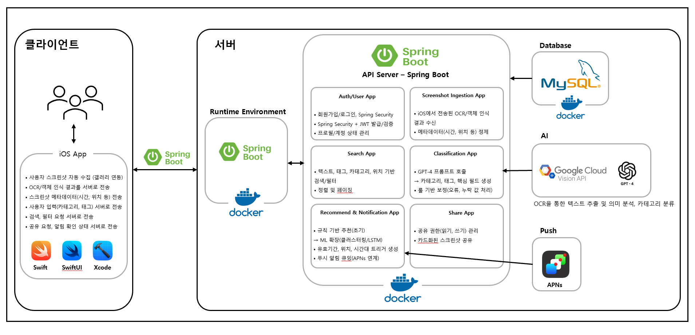
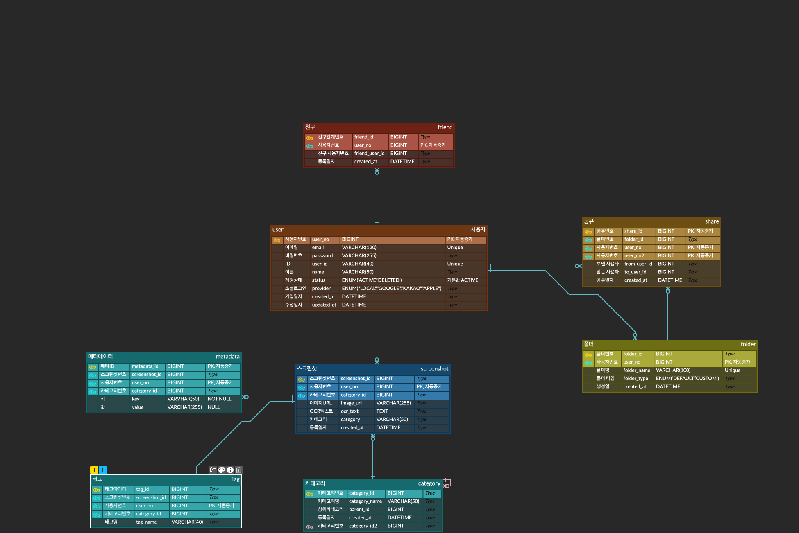

# 24팀 강배우 1차 보고서

## 📸 CapLog
"잊혀진 스크린샷, 새로운 가치로 재탄생하다": OCR·GPT-4 기반
개인화 스크린샷 정보 관리 서비스

## 📋 목차
1. Team Info 
1.1 과제명 
1.2 팀 정보 (팀 번호, 팀 이름 등) 
1.3 팀 구성원
2. Project-Summary 
2.1 문제 정의: 과제의 배경, 필요성의 당위성 
2.2 기존 연구와의 비교 
2.3 제안 내용 
2.4 기대 효과 및 의의
2.5 주요 기능 리스트
3. Project-Design 
3.1 요구사항 정의 
3.2 전체시스템 구성
### Team Info
과제명: 사용자 스크린샷 속 정보를 AI가 자동 분석하여, 위치·시간대·일정 등 생활 맥락에 따라 맞춤 정보를 제공하는 개인화 정보 추천 서비스 
- 팀번호: 24
- 팀명: 강배우
- 지도교수: 민동보 교수님
- 팀 구성원: 강다혜(팀장, AI·백엔드), 배서연(팀원, AI·백엔드), 우민하(팀원, 프론트엔드)

### Project-Summary

| 항목 | 내용 |
|---|---|
| 1. 문제 정의 | 본 과제의 Target Customer는 스크린샷을 자주 찍는 20~30대 디지털 네이티브이다. 이들은 SNS, 웹서핑, 쇼핑몰 등에서 얻은 유용한 정보를 스크린샷으로 저장하지만, 시간이 지나면 무작위로 쌓여 원하는 정보를 찾기 어렵다. 특히 쿠폰·이벤트와 같은 유효기간이 있는 정보는 제때 확인하지 못해 무용지물이 되는 경우가 많다. 또한 사용자는 스스로 스크린샷을 분류하고 정리해야 하므로 관리가 번거롭다. 결과적으로 스크린샷은 갤러리에 방치된 채 ‘디지털 무덤’으로 전락한다.  과제의 필요성을 네 가지 측면에서 정리하면 다음과 같다. 첫째, 스크린샷은 단순히 저장에 머물러 있어 필요한 정보를 다시 찾기 어려워 정보 관리가 제대로 이루어지지 않는다. 둘째, 쿠폰이나 이벤트처럼 유효기간이 있는 정보는 방치되기 쉬워 활용 기회를 잃게 되며, 사용자는 직접 정리·검색해야 하는 부담을 안게 된다. 셋째, 스크린샷은 언제, 어디서 이 정보가 필요한지 맥락을 반영하지 못해 실질적인 활용이 어렵다. 넷째, 기존 서비스들은 단순히 사진을 ‘스크린샷’으로 분류하는 수준에 그쳐, 친구나 지인과 정보를 공유하는 기능이 부족하다. 예를 들어 삼성 갤러리는 쿠폰·탑승권 등을 단순 분류할 수 있으나, 맥락 기반 추천이나 유효기간 알림, 구조적 공유 기능은 제공하지 못한다.  따라서 본 과제는 기존 서비스가 제공하지 못하는 실질적 활용과 공유 기능을 구현하는 데 목적이 있다. 스크린샷 속 정보를 자동으로 분류·정리하고, 유효기간·위치·일정 등 맥락을 반영해 적절한 시점에 다시 제공함으로써, 사용자가 스크린샷을 생활 속에서 효과적으로 활용할 수 있는 개인화 정보 관리 서비스를 실현하고자 한다. |
| 2. 기존연구와의 비교 | **[기존 유사과제]**  **(1) 삼성 갤러리** 장점: 스크린샷을 일반 사진과 구분하며, AI 기반 자동 분류를 제공함 단점: 카테고리 세분화 부족, 사용자 임의 카테고리 불가, 의미 기반 분류 불가, 개인화 추천 기능 없음  **(2) Google 포토** 장점: AI 기반 이미지 인식, 자동 앨범 분류, 강력한 검색 기능 제공 단점: 스크린샷 구분 불가, 맥락적 활용 불가, 공유는 앨범 단위로 한정  **(3) Evernote / Notion** 장점: 태그, 폴더, 검색 기능 제공 단점: 스크린샷 자동 분류 불가, 이미지 맥락 해석 불가, 사용자가 직접 입력해야 함  **CapLog의 차별성** 기존 서비스들이 자동 분류, 맥락적 해석, 개인화 추천, 공유 측면에서 한계를 보이는 반면, CapLog는 **멀티모달 의미 해석과 AI 기반 카테고리/태그 생성**, **위치·시간·유효기간 등 맥락 반영 추천**, **사용자 정의 카테고리 및 공유 기능**을 제공함으로써 기존 서비스와 뚜렷한 차별성을 가진다. |
| 3. 제안 내용 | CapLog는 기존 갤러리/메모 서비스가 단순 저장과 분류에 머무르는 한계를 극복하고, 스크린샷을 생활 속에서 활용 가능한 정보 자산으로 전환하기 위한 서비스이다. 사용자가 스크린샷을 저장만 하고 활용하지 못하는 문제를 해결하기 위해, CapLog는 AI 기반 분석·분류, 맥락 기반 추천, 공유 기능을 결합한 종합적 솔루션을 제안한다.  **주요 목표** 1. 스크린샷 자동 정리 • VisionKit OCR로 날짜·장소·텍스트 추출 • Google Vision으로 상품·쿠폰 등 객체 탐지 • GPT-4 기반 의미 분석 → 카테고리·태그·위치·유효기간 자동 분류 • Spring 커스텀 로직으로 태그 정리 및 표준화  2. 알림 및 리마인드 제공 • GPT-4 분류 결과를 기반으로 카테고리 확정 • 유효기간·마감일 등 중요한 정보를 적절한 시점에 알림  3. 생활 패턴·맥락 기반 추천 • CoreLocation, EventKit 연동으로 시간·위치·일정 맥락 반영 • 세션 로깅을 통한 생활 패턴 분석 및 예측 추천  4.스크린샷 정보 공유 • 친구·그룹 단위 공유 기능 제공 • 공유 폴더 기반 협업 지원 • 개인 정보에서 그룹 활용성으로 확장  **주요 기능** 1. 멀티모달 정보 추출: VisionKit OCR + Google Vision API 2. AI 기반 의미 분류 및 카테고리/태그 생성 3. 위치·시간·일정 맥락을 반영한 개인화 추천 4. 사용자 정의 추가/수정 기능 5. Merge & Share 기반 정보 공유 기능  따라서 CapLog는 단순한 ‘스크린샷 관리 앱’을 넘어, **정보의 자동 정리 → 필요 시점 알림 → 맥락 기반 추천 → 협업 공유**까지 연결하는 스마트 정보 활용 플랫폼으로 발전할 것이다. |
| 4. 기대효과 및 의의 | CapLog는 스크린샷 정보 활용 가치를 높이고, 자동화·개인화·공유 측면에서 의미가 크다.  • 잊혀진 정보의 재활용 → 실질적 혜택 유효기간 정보를 인식해 적절한 시점에 알림을 제공, 방치되던 쿠폰·이벤트를 실제로 활용 가능  • 정리 스트레스 감소 → 정보 관리 자동화 스크린샷을 자동 분류·추천해 사용자가 별도 정리 없이도 효율적으로 관리 가능  • 위치 기반 리마인드 → 정보와 행동 연결 맛집, 장소 등 위치 맥락을 반영해 실시간 상황에 맞춘 활용 가능  • 공유 가치 확대 → 협업과 확장성 Merge & Share로 친구·팀원과 공동 활용, 개인 정보가 사회적 자산으로 확장  • 사회적 의의 → 디지털 자원의 재활용 방치된 스크린샷을 자산화하여 효율적 정보 관리와 스마트 라이프스타일 지원 |
| 5. 주요 기능 리스트 | **기능1. 스크린샷 정보 추출** VisionKit OCR을 활용해 스크린샷 내 텍스트를 인식하고, Google Vision API로 상품·쿠폰 등 시각적 요소를 보완적으로 탐지하여 정보 추출 정확도를 높인다.   **기능2. AI 기반 의미 분류** 추출된 정보를 GPT-4 API로 분석하여 카테고리와 메타데이터(가게명, 위치, 유효기간 등)를 자동 생성하고 구조화한다.  **기능3. 개인화 추천/알림** 사용자의 위치(CoreLocation)와 일정(EventKit)을 기반으로, 저장된 정보가 필요한 시점에 맞춤 알림과 추천을 제공한다.  **기능4. 사용자 정의 카테고리** 고정된 체계에 국한되지 않고, 사용자가 자신의 관심사에 맞게 카테고리를 추가·수정할 수 있어 개인별 맞춤 관리가 가능하다.  **기능5. 공유 및 협업** 카드·폴더 단위로 정보를 공유하고 공동 관리할 수 있어, 개인적 정보가 팀이나 그룹 단위의 협업 자원으로 확장된다. |

### Project-Design & Implementation

| 항목 | 내용 |
|------|------|
| 1. 요구사항 정의 | **CapLog**은 사용자의 스크린샷을 자동 분류하고, 이를 기반으로 맞춤 추천을 제공하는 서비스다. iOS 앱(SwiftUI) + Spring Boot 백엔드 + MySQL DB로 구현되며, 주요 요구사항은 다음과 같다.  **회원 관리** • 회원가입: 이메일/비밀번호/아이디/이름 입력 및 필수 동의 • 로그인/로그아웃: JWT 기반 인증 • 프로필 관리: 이름, 이메일 수정 및 계정 탈퇴  **스크린샷 관리** • iOS Photos Framework 자동 연동 • VisionKit OCR로 텍스트 추출 • GPT API로 의미 분석 및 카테고리 분류 • 메타데이터(위치, 시간, 태그 등) 저장  **추천 기능** • 최근 스크린샷 3개 추천 • 알림 기능 (적절한 시점에 재제공)  **검색 기능** • OCR 텍스트 검색 • 태그/카테고리 기반 필터링  **공유 기능** • 스크린샷 카드 공유 • 폴더 개인화  **비기능 요구사항** • 보안성: BCrypt 비밀번호 해싱, JWT 인증 • 확장성: 신규 카테고리/기능 추가 용이 • 가용성: Docker 기반 MySQL 볼륨 관리 • 성능: OCR + GPT API 응답 최적화 |
| 2. 전체 시스템 구성 | **[구성 요소]** **iOS 프론트엔드 (SwiftUI)** • UI: 회원가입/로그인/메인/검색/마이페이지/폴더/친구/스크린샷 • Photos Framework로 기기 갤러리 접근 • VisionKit OCR • REST API 연동  **백엔드 (Spring Boot, Java17)** • 모듈: 회원, 로그인, 스크린샷, 추천, 검색, 공유 • 보안: Sping Security + JWT • DB 연동: JPA + MySQL  **DB (MySQL on Docker)** • 주요 테이블: user, screenshot, category, folder, share, metadata, tag • mysql-data 볼륨으로 영속성 보장  **외부 API** • GPT-4 (텍스트 의미 분석/분류) • VisionKit (OCR)   |
| 3. 주요 엔진 및 기능 설계 | **OCR 엔진** • iOS VisionKit → 이미지 텍스트 추출  **의미 분석 엔진** • GPT-4 API 호출 → 텍스트 의미 분석 후 카테고리 반환  **추천 엔진** • 초기: Rule 기반 (최근 검색/저장 이력) • 확장: 유사도 기반 추천 (embedding/vector DB 도입 가능)  **데이터베이스 구조** • user: 회원 계정 • screenshot: 스크린샷 메타정보 • category: 계층형 카테고리 • metadata: key-value 저장 (위치, 주소 등) • tag: 사용자 정의 태그   |
| 4. 주요 기능의 구현 | **회원 관리 (로그인/회원가입)** • 목표: 안전한 가입·로그인 및 개인화 데이터 사용 • 구현: BCrypt 해싱 비밀번호 저장, JWT 발급·검증, Authorization 헤더 인증 • user 테이블에 계정/상태 관리  **스크린샷 자동 분류 및 카드 생성** • iOS에서 스크린샷 발생 시 VisionKit OCR 텍스트 추출 • GPT API로 의미 분석 → 카테고리/태그/핵심정보 반환 • 백엔드 DB 저장 후 카드(JSON) 형태로 클라이언트 제공 • 효과: 스크린샷을 정보 단위(Card)로 검색/추천/공유 가능  **공유 기능 (카드·폴더 협업)** • 카드 상세 화면 → 공유 버튼으로 전송 • 공유방에서 카드 미리보기 표시 • 폴더 단위로 분류/저장 + 권한(읽기/쓰기/관리) 부여 • 공유방 = 채팅방 형태, WebSocket 기반 실시간 알림 확장 가능 |